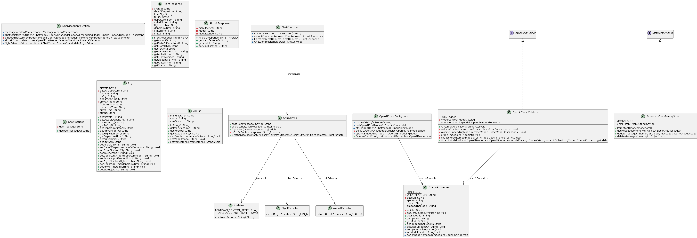
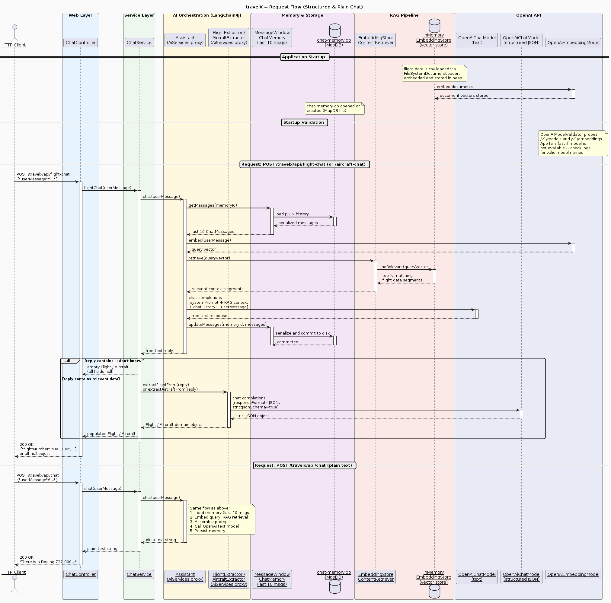

# travelX — Gen-AI Driven Spring Boot Application

**travelX** is a Spring Boot application that exposes a conversational REST API backed by an OpenAI-compatible Large Language Model (LLM). It uses **LangChain4j** for AI orchestration, **RAG** (Retrieval-Augmented Generation) for grounding answers in company flight data, and **MapDB** for persistent chat memory across restarts.

---

## Table of Contents

1. [Key Concepts](#key-concepts)
2. [Architecture Overview](#architecture-overview)
3. [Application Flow — Behind the Scenes](#application-flow--behind-the-scenes)
   - [Plain Chat (`/api/chat`)](#plain-chat-apichat)
   - [Structured Content (`/api/flight-chat` and `/api/aircraft-chat`)](#structured-content-apiflight-chat-and-apiaircraft-chat)
4. [Startup Validation Mechanism](#startup-validation-mechanism)
5. [Configuration Properties](#configuration-properties)
6. [Frameworks & Libraries](#frameworks--libraries)
7. [Company Data — RAG Source Files](#company-data--rag-source-files)
8. [Persistent Chat Memory](#persistent-chat-memory)
9. [Class Diagram](#class-diagram)
10. [API Reference & Examples](#api-reference--examples)
11. [Running the Application](#running-the-application)

---

## Key Concepts

### OpenAI
**OpenAI** is an AI research company that provides cloud-hosted Large Language Models (LLMs) accessible via a REST API (e.g., `https://api.openai.com/v1`). This application communicates with OpenAI (or any OpenAI-compatible endpoint such as a LiteLLM proxy or a local Ollama instance) to generate natural-language responses and structured JSON output.

### LLM / SLM
- **LLM (Large Language Model)** — a neural network trained on massive text corpora capable of understanding and generating human language. Examples: `gpt-4o`, `gpt-4o-mini`.
- **SLM (Small Language Model)** — a compact variant of an LLM optimised for lower resource usage. Examples: `deepseek-r1:1.5b`, `phi-3-mini`. The application supports both via the `openai.model` property.

### Embedding Models
An **embedding model** converts text into a high-dimensional numeric vector (a list of floating-point numbers). Semantically similar texts produce vectors that are close together in vector space. This application uses `text-embedding-3-small` (OpenAI) to embed both the company flight documents at startup and the user's query at request time, enabling semantic similarity search (RAG).

### RAG (Retrieval-Augmented Generation)
**RAG** is a pattern that augments an LLM's response with relevant context retrieved from an external knowledge source:

1. At startup, company documents (flight data files from [`src/main/resources/static/`](src/main/resources/static/)) are embedded and stored in an **in-memory vector store**.
2. When a user sends a query, the query is embedded and the most semantically similar document segments are retrieved from the vector store.
3. The retrieved segments are injected into the LLM prompt as additional context, allowing the model to answer questions about company-specific data it was never trained on.

### In-Memory Vector Store
This application uses LangChain4j's [`InMemoryEmbeddingStore`](src/main/java/sk/mkrajcovic/travelx/config/AiServicesConfiguration.java) — a simple, non-persistent, heap-based vector store. It is populated once at application startup by ingesting the flight data files. **Because it is in-memory, the store is rebuilt from scratch on every application restart.** This is suitable for small datasets; for production use, a persistent vector database (e.g., Chroma, Qdrant, Weaviate) would be preferred.

---

## Architecture Overview

```
HTTP Client
    │
    ▼
[ChatController]  /api/chat | /api/aircraft-chat | /api/flight-chat
    │
    ▼
[ChatService]
    │
    ├──► [Assistant] (LangChain4j proxy)
    │         │
    │         ├── MessageWindowChatMemory (last 10 messages, via PersistentChatMemoryStore → chat-memory.db)
    │         ├── EmbeddingStoreContentRetriever (RAG: InMemoryEmbeddingStore + OpenAiEmbeddingModel)
    │         └── OpenAiChatModel (text) → OpenAI API
    │
    └──► [FlightExtractor | AircraftExtractor] (LangChain4j proxy, structured JSON output)
              └── OpenAiChatModel (structured, responseFormat=JSON, strictJsonSchema=true) → OpenAI API
```

---

## Application Flow — Behind the Scenes

### Plain Chat (`/api/chat`)

1. The HTTP client sends a `POST /travelx/api/chat` with `{"userMessage": "..."}`.
2. [`ChatController`](src/main/java/sk/mkrajcovic/travelx/controller/ChatController.java) validates the request body and delegates to [`ChatService.chat()`](src/main/java/sk/mkrajcovic/travelx/service/ChatService.java).
3. [`ChatService`](src/main/java/sk/mkrajcovic/travelx/service/ChatService.java) calls `assistant.chat(userMessage)`.
4. The LangChain4j-generated [`Assistant`](src/main/java/sk/mkrajcovic/travelx/chat/Assistant.java) proxy:
   a. Loads the last **10 messages** from [`PersistentChatMemoryStore`](src/main/java/sk/mkrajcovic/travelx/memory/PersistentChatMemoryStore.java) (backed by `chat-memory.db`).
   b. Embeds the user query via `OpenAiEmbeddingModel` and retrieves the most relevant segments from the `InMemoryEmbeddingStore` (RAG).
   c. Assembles the full prompt: **system message** (travel assistant rules) + **retrieved RAG context** + **chat history** + **user message**.
   d. Sends the assembled prompt to `OpenAiChatModel` (text mode).
   e. Stores both the user message and the assistant reply back into `PersistentChatMemoryStore`.
   f. Returns the plain-text response string.
5. The controller returns the string response directly to the client.

### Structured Content (`/api/flight-chat` and `/api/aircraft-chat`)

Steps 1–4 are identical to the plain chat flow. The difference begins after the `Assistant` returns its free-text reply:

5. [`ChatService`](src/main/java/sk/mkrajcovic/travelx/service/ChatService.java) checks whether the assistant's reply contains the sentinel string `"I don't know."` (defined as [`Assistant.UNKNOWN_CONTEXT_REPLY`](src/main/java/sk/mkrajcovic/travelx/chat/Assistant.java)).
   - **If yes** → the model had no relevant context. An **empty domain object** (`new Flight()` or `new Aircraft()`) with all `null` fields is returned immediately — no second LLM call is made.
   - **If no** → the free-text reply is passed to the appropriate extractor.
6. The extractor ([`FlightExtractor`](src/main/java/sk/mkrajcovic/travelx/chat/FlightExtractor.java) or [`AircraftExtractor`](src/main/java/sk/mkrajcovic/travelx/chat/AircraftExtractor.java)) is a LangChain4j-generated proxy backed by a **second `OpenAiChatModel`** configured with `responseFormat=JSON` and `strictJsonSchema=true`. It sends the free-text reply to the model and receives a strictly validated JSON object mapped directly to [`Flight`](src/main/java/sk/mkrajcovic/travelx/model/Flight.java) or [`Aircraft`](src/main/java/sk/mkrajcovic/travelx/model/Aircraft.java).
7. The controller wraps the domain object in a response DTO ([`FlightResponse`](src/main/java/sk/mkrajcovic/travelx/controller/dto/FlightResponse.java) / [`AircraftResponse`](src/main/java/sk/mkrajcovic/travelx/controller/dto/AircraftResponse.java)) and serialises it to JSON.

> **Summary of the two-LLM-call pattern for structured endpoints:**
> - **Call 1** — `Assistant` (text model + RAG + memory) → free-text answer grounded in company data.
> - **Call 2** — `FlightExtractor` / `AircraftExtractor` (structured JSON model) → typed domain object.

---

## Startup Validation Mechanism

[`OpenAiModelValidator`](src/main/java/sk/mkrajcovic/travelx/startup/OpenAiModelValidator.java) implements `ApplicationRunner` and executes immediately after the Spring context is fully initialised.

It performs three checks:

| Step | What is validated | Failure behaviour |
|------|-------------------|-------------------|
| 1 | Calls `GET /v1/models` via `ModelCatalog` and checks that `openai.model` is present in the list | Throws `IllegalStateException` with the list of valid model names |
| 2 | Checks that `openai.embedding-model` is present in the same model list | Throws `IllegalStateException` with the list of valid model names |
| 3 | Sends a minimal probe string (`"startup probe"`) to `POST /v1/embeddings` to confirm the embedding model actually serves embedding requests | Throws `IllegalStateException` — some providers list models that do not support embeddings |

**To see which models are available** for your configured API endpoint, check the application logs at startup. When validation fails, the log will contain the full list of supported model names returned by the API.

Example log output on success:
```
INFO  OpenAI server/host is set to https://api.openai.com/v1
INFO  OpenAI model: gpt-4o-mini
INFO  OpenAI embedding model: text-embedding-3-small
INFO  Validating OpenAI chat model 'gpt-4o-mini' against available models...
INFO  OpenAI chat model 'gpt-4o-mini' is valid and supported.
INFO  Validating OpenAI embedding model 'text-embedding-3-small' against available models...
INFO  Embedding model 'text-embedding-3-small' confirmed working via /v1/embeddings.
INFO  OpenAI embedding model 'text-embedding-3-small' is valid and supports embeddings.
```

---

## Configuration Properties

Base defaults are defined in [`src/main/resources/application.properties`](src/main/resources/application.properties). Select a ready-made profile to override them, or supply values via environment variables.

### Spring Profiles

Two pre-configured profile files are provided:

| Profile file | Activated with | Host | Chat model | Embedding model |
|---|---|---|---|---|
| [`application-public-openai.properties`](src/main/resources/application-public-openai.properties) | `--spring.profiles.active=public-openai` | `https://api.openai.com/v1` | `gpt-4o-mini` | `text-embedding-3-small` |
| [`application-litellm-gratex.properties`](src/main/resources/application-litellm-gratex.properties) | `--spring.profiles.active=litellm-gratex` | `https://litellm.gratex.ai/v1` | `google/claude-sonnet-4-6` | `ollama-embedding-qwen3-06` |

Set `openai.api-key` in the chosen profile file (or via an environment variable) before starting the application.

### Required Properties

| Property | Description | Default |
|----------|-------------|---------|
| `openai.api-key` | API key for the OpenAI-compatible endpoint. **Mandatory** — application fails to start without it. | `provide_your_api-key` (placeholder) |
| `openai.model` | Chat/completion model name (e.g., `gpt-4o-mini`, `google/claude-sonnet-4-6`). **Mandatory.** | `gpt-4o-mini` |
| `openai.embedding-model` | Embedding model name (e.g., `text-embedding-3-small`, `ollama-embedding-qwen3-06`). **Mandatory** — required for RAG. | `text-embedding-3-small` |

### Default Behaviour

- If `openai.host` is not set, [`OpenAiProperties`](src/main/java/sk/mkrajcovic/travelx/config/OpenAiProperties.java) silently defaults to `https://api.openai.com/v1` and logs a DEBUG message.
- If `openai.api-key`, `openai.model`, or `openai.embedding-model` are blank, Spring's `@Validated` bean validation fires at context startup and the application **fails fast** with a descriptive error message.
- Chat memory retains the **last 10 messages** (5 user + 5 assistant turns) per conversation. Older messages are silently dropped from the active window but remain in `chat-memory.db`.

---

## Frameworks & Libraries

### LangChain4j (`dev.langchain4j`, version `1.16.1`)

[LangChain4j](https://github.com/langchain4j/langchain4j) is a Java framework for building LLM-powered applications. It provides:

- **`AiServices`** — generates runtime proxy implementations of user-defined interfaces (e.g., [`Assistant`](src/main/java/sk/mkrajcovic/travelx/chat/Assistant.java), [`FlightExtractor`](src/main/java/sk/mkrajcovic/travelx/chat/FlightExtractor.java), [`AircraftExtractor`](src/main/java/sk/mkrajcovic/travelx/chat/AircraftExtractor.java)) that wire together the model, memory, and retrieval pipeline automatically.
- **`OpenAiChatModel`** — HTTP client for the OpenAI chat completions API (`/v1/chat/completions`).
- **`OpenAiEmbeddingModel`** — HTTP client for the OpenAI embeddings API (`/v1/embeddings`).
- **`MessageWindowChatMemory`** — sliding-window chat memory that keeps the last N messages.
- **`EmbeddingStoreContentRetriever`** — RAG retriever that embeds the user query and fetches the most similar segments from the embedding store.
- **`InMemoryEmbeddingStore`** — heap-based vector store (non-persistent, rebuilt on every startup).
- **`EmbeddingStoreIngestor`** — pipeline that loads documents, splits them, embeds them, and stores them in the embedding store.
- **`@SystemMessage`** — annotation on [`Assistant.chat()`](src/main/java/sk/mkrajcovic/travelx/chat/Assistant.java) that injects a fixed system prompt into every model request, defining the assistant's role and behavioural constraints.

In this project, LangChain4j is used in [`AiServicesConfiguration`](src/main/java/sk/mkrajcovic/travelx/config/AiServicesConfiguration.java) and [`OpenAiClientConfiguration`](src/main/java/sk/mkrajcovic/travelx/config/OpenAiClientConfiguration.java) to wire all AI components as Spring beans.

### langchain4j-easy-rag (`dev.langchain4j:langchain4j-easy-rag`, version `1.16.1-beta26`)

The **Easy RAG** module provides high-level utilities for document loading and ingestion:

- **`FileSystemDocumentLoader`** — loads all text files from a directory (used to load [`src/main/resources/static/`](src/main/resources/static/)).
- **`TextDocumentParser`** — parses plain-text and CSV files into `Document` objects.

> **Note:** The default Easy RAG splitter (`RecursiveDocumentSplitterFactory`) depends on `HuggingFaceTokenCountEstimator` from the `langchain4j-embeddings-bge-small-en-v15-q` ONNX artifact, which requires `libtokenizers.so` compiled against GLIBC 2.32+. Because the development system has GLIBC 2.31, that artifact is **excluded** from the classpath and a custom no-op splitter is used instead (each document is treated as a single segment). See [`AiServicesConfiguration.embeddingStore()`](src/main/java/sk/mkrajcovic/travelx/config/AiServicesConfiguration.java).

### MapDB (`org.mapdb:mapdb`, version `3.1.0`)

[MapDB](https://mapdb.org/) is an embedded Java database engine that provides persistent, off-heap data structures backed by a file. In this project it is used by [`PersistentChatMemoryStore`](src/main/java/sk/mkrajcovic/travelx/memory/PersistentChatMemoryStore.java) to persist conversation history to [`chat-memory.db`](chat-memory.db) in the application root directory. Each write is immediately committed (`database.commit()`) to ensure durability.

---

## Company Data — RAG Source Files

The directory [`src/main/resources/static/`](src/main/resources/static/) contains the company's flight data used as the RAG knowledge base:

| File | Format | Description |
|------|--------|-------------|
| [`flight-details.csv`](src/main/resources/static/flight-details.csv) | CSV | 10 US domestic flights with aircraft type, cities, airports, flight numbers, times, and status |
The file is loaded at startup by `FileSystemDocumentLoader`, embedded via `OpenAiEmbeddingModel`, and stored in the `InMemoryEmbeddingStore`. When a user asks a flight-related question, the most relevant rows are retrieved and injected into the LLM prompt.

---

## Persistent Chat Memory

The file [`chat-memory.db`](chat-memory.db) is created automatically in the **application root directory** on first startup. It is a MapDB file-based database containing a hash map named `messages` that maps memory IDs to JSON-serialised lists of [`ChatMessage`](src/main/java/sk/mkrajcovic/travelx/memory/PersistentChatMemoryStore.java) objects.

- **Survives restarts** — conversation history is restored from disk on the next startup.
- **Sliding window** — only the last 10 messages are kept in the active context window sent to the model. Older messages remain in the file but are not sent to the LLM.
- **Thread-safe** — MapDB transactions ensure consistency under concurrent access.

---

## Diagrams

### Class Diagram



### Application Flow



> The flow diagram above is generated from [`flow-diagram.puml`](flow-diagram.puml).

---

## API Reference & Examples

All endpoints are prefixed with the context path `/travelx`. The server runs on port `8080` by default.

### `POST /travelx/api/chat`

Free-form conversational chat. Returns a plain-text string.

**Request body:**
```json
{"userMessage": "What flights are available from Denver?"}
```

**Response:** `200 OK`, `Content-Type: application/json`
```
"There is a Boeing 737-800 flight UA1138 departing Denver International Airport on 2025-05-20 at 17:10, arriving at Los Angeles International Airport at 22:34. The current status is Boarding."
```

---

### `POST /travelx/api/flight-chat`

Returns structured flight information extracted from the assistant's response.

**Request body:**
```json
{"userMessage": "give me flight details for earliest flight that has not departed yet"}
```

**Response:** `200 OK`
```json
{
  "aircraft": "Boeing 737-800",
  "arrivalAirport": "Los Angeles International Airport",
  "arrivalTime": "22:34",
  "dateOfDeparture": "2025-05-20",
  "departureAirport": "Denver International Airport",
  "departureTime": "17:10",
  "flightNumber": "UA1138",
  "fromCity": "Denver",
  "status": "Boarding",
  "toCity": "Denver"
}
```

**Negative example** — when the model cannot find relevant data (e.g., asking about a non-existent flight):

**Request body:**
```json
{"userMessage": "give me flight details for flight XY9999"}
```

**Response:** `200 OK` — all fields are `null` because the assistant replied `"I don't know."`:
```json
{
  "aircraft": null,
  "arrivalAirport": null,
  "arrivalTime": null,
  "dateOfDeparture": null,
  "departureAirport": null,
  "departureTime": null,
  "flightNumber": null,
  "fromCity": null,
  "status": null,
  "toCity": null
}
```

---

### `POST /travelx/api/aircraft-chat`

Returns structured aircraft information extracted from the assistant's response.

**Request body:**
```json
{"userMessage": "give me details for Boeing 737-800"}
```

**Response:** `200 OK`
```json
{
  "manufacturer": "Boeing",
  "maxDistance": "5940 km",
  "model": "737-800"
}
```

**Negative example** — when the model cannot find relevant data (e.g., asking about an unknown aircraft):

**Request body:**
```json
{"userMessage": "give me details for AircraftX Z-1000"}
```

**Response:** `200 OK` — all fields are `null`:
```json
{
  "manufacturer": null,
  "maxDistance": null,
  "model": null
}
```

---

### Request Validation

All endpoints share the same [`ChatRequest`](src/main/java/sk/mkrajcovic/travelx/controller/dto/ChatRequest.java) body with the following constraints:

| Field | Constraint | Error on violation |
|-------|------------|--------------------|
| `userMessage` | `@NotBlank` | `400 Bad Request` |
| `userMessage` | `@Size(max = 500)` | `400 Bad Request` |

---

## Running the Application

### Prerequisites

- Java 21+
- Maven 3.9+ (or use the included `mvnw` wrapper)
- A valid OpenAI API key (or a compatible proxy endpoint)

### Steps

1. **Set your API key** — open the profile file you want to use and replace the placeholder:
   ```properties
   # in application-public-openai.properties or application-litellm-gratex.properties
   openai.api-key=sk-your-actual-key-here
   ```

2. **Run with the chosen profile:**
   ```bash
   # OpenAI (gpt-4o-mini + text-embedding-3-small)
   ./mvnw spring-boot:run -Dspring-boot.run.profiles=public-openai

   # Gratex LiteLLM proxy (google/claude-sonnet-4-6 + ollama-embedding-qwen3-06)
   ./mvnw spring-boot:run -Dspring-boot.run.profiles=litellm-gratex
   ```

3. **Verify startup** — check the logs for the validation output. If the configured model is not available, the application will print the list of valid models and exit.

4. **Send a request:**
   ```bash
   curl -X POST http://localhost:8080/travelx/api/flight-chat \
     -H "Content-Type: application/json" \
     -d '{"userMessage":"give me flight details for earliest flight that has not departed yet"}'
   ```
